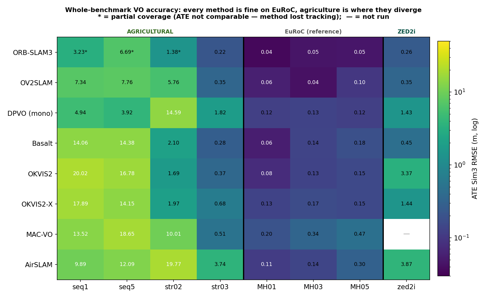
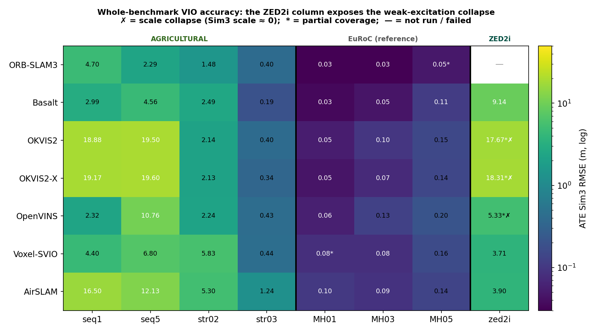
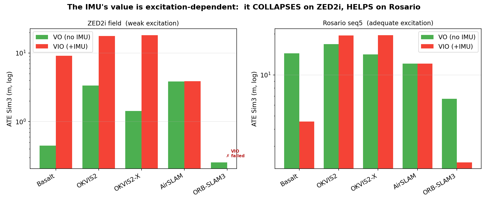
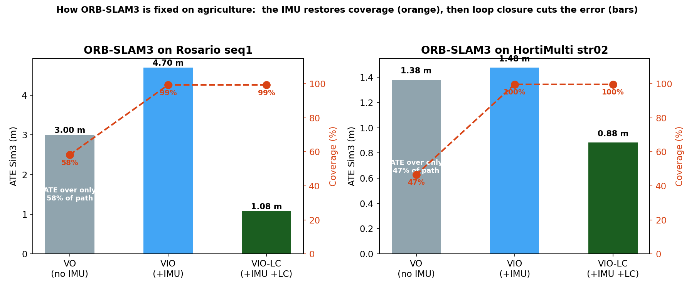
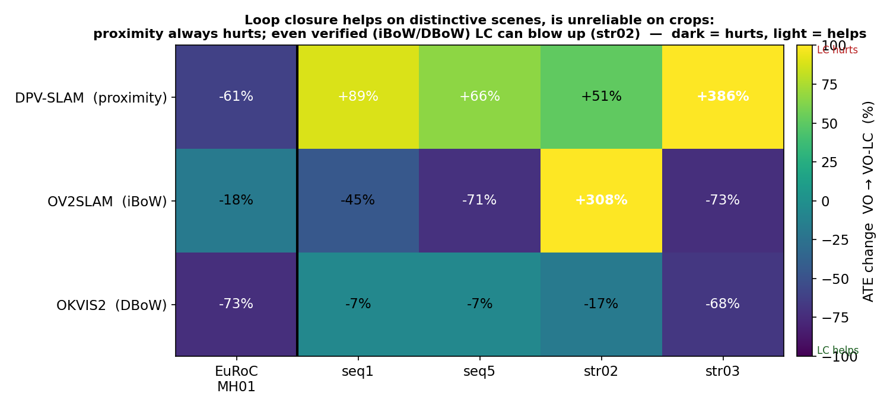
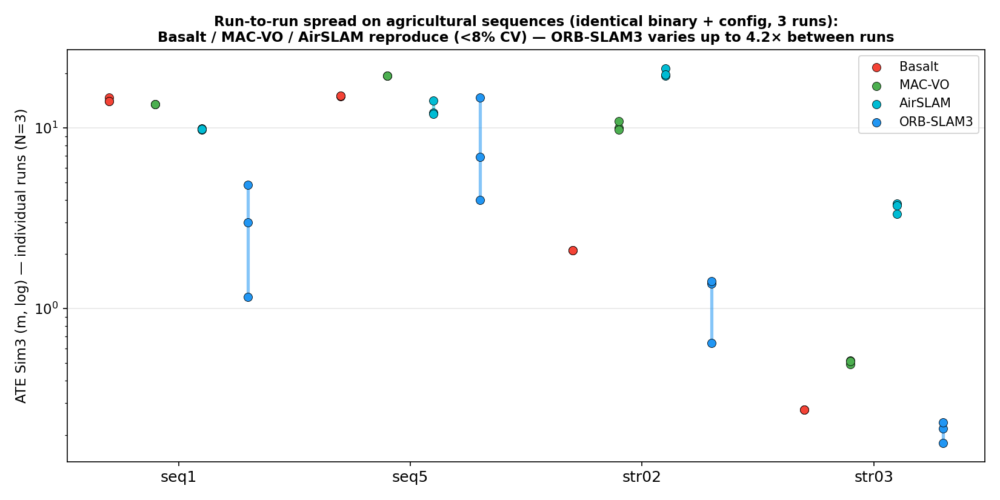

# Progress report on vSLAM benchmarking — 04.08.26

**Ivan Moroz / Jion Kubo**

---

## Summary

Since the last report (24.05.26: 5 algorithms, stereo-VO only, 3 datasets) the benchmark has grown to
**15 algorithms, 5 operating modes (VO / VO-LC / VIO / VIO-LC / GNSS-VIO), 4 datasets — 213 evaluated
configurations, 259 individual runs**, including our own RTK-referenced ZED2i field dataset. On the
EuRoC reference every method performs as expected (0.03–0.2 m); the differences between algorithms
appear only on the agricultural sequences.

**Key findings**

1. **The IMU helps only with excitation.** On the slow, smooth ZED2i field run the tightly-coupled VIO
   filters scale-collapse (5–18 m) while stereo VO stays at 0.26–0.45 m; on the more agile Rosario
   sequences the same IMU rescues tracking and wins (ORB-SLAM3 VIO-LC 1.08 m, best on the benchmark).
2. **Classical sparse-feature tracking hard-fails on crops.** ORB-SLAM3 loses tracking on 40–60 % of the
   outdoor sequences and its low agricultural "VO" ATE is an artifact of the shorter tracked sub-path;
   flow-based, learned, and sliding-window front-ends degrade gracefully at 100 % coverage.
3. **Loop closure on crops is mechanism-dependent and never fully safe.** Proximity closure always hurts;
   verified iBoW/DBoW closure helps on distinctive scenes and true revisits but each blew up on at least
   one aliased agricultural sequence (up to +308 %).
4. **Single runs can mislead.** ORB-SLAM3 varies up to ~4× between identical runs on agricultural
   sequences (its agri cells are reported as N=3 median + range); most real-time estimators are
   structurally non-deterministic and are so far single-run.

---

## 1. Experimental setup

### 1.1 Datasets

| Dataset | Environment | Motion / excitation | Camera | Ground truth | Frames / path |
|---|---|---|---|---|---|
| Rosario v2 (seq1, seq5) | outdoor soybean rows | turns, varied — **adequate** | RealSense D435i stereo, 1280×720 @15 Hz | PPK GPS+INS | 13.8k / 11.6k |
| HortiMulti (str02, str03) | indoor strawberry polytunnel | short loop, row markers | Basler stereo, 1936×1216 @10 Hz | mocap / lidar ref | 9.5k / 2.4k |
| **ZED2i field1** (ours) | outdoor agricultural field | slow, smooth, straight — **weak** | ZED2i stereo, 1920×1080 @10 Hz | RTK-GPS (position) | 46.3k / 413 m / 77 min |
| EuRoC-MAV (MH_01/03/05) | *[non-agricultural reference]* indoor MAV | agile, all-DoF | VI-Sensor stereo, 752×480 @20 Hz | Vicon | 3.7k / 2.7k / 2.3k |

### 1.2 Algorithms

| Algorithm | Type | Front-end | LC mechanism | Modes run |
|---|---|---|---|---|
| ORB-SLAM3 | classical feature | ORB descriptor matching | DBoW2 + geometric verif. | VO, VO-LC, VIO, VIO-LC |
| OKVIS2 / OKVIS2-X | sliding-window MAP VIO | descriptors + IMU | DBoW + Sim3 | VO†, VO-LC†, VIO, VIO-LC (+GNSS for -X) |
| Basalt | sliding-window VIO | optical flow + IMU | — | VO, VIO |
| OV2SLAM | online stereo VO | KLT optical flow | online iBoW | VO, VO-LC |
| AirSLAM | deep-feature VO/VIO | SuperPoint-style | offline map-refinement | VO, VIO, VIO-LC |
| DPVO / DPV-SLAM | learned **monocular** VO | patch network | proximity | VO, VO-LC |
| MAC-VO | learned-uncertainty stereo VO | learned matching | — | VO |
| OpenVINS / Voxel-SVIO | MSCKF filter VIO | KLT + IMU | — | VIO |
| VINS-Fusion, CIFASIS GNSS-SI, RTAB-Map, OpenVINS+GPS | GNSS fusion | — | — | GNSS-VIO |

† OKVIS2/OKVIS2-X "VO" = IMU residuals disabled (best-effort degraded mode of a VI system).
DROID-SLAM was dropped early (replaced by DPVO, 9–13× more accurate); MASt3R-SLAM and MegaSaM are
installed but **hardware-blocked** (OOM on the 12 GB GPU).

### 1.3 Metrics and protocol

- **ATE Sim3** RMSE (monocular-comparable) and **ATE SE3** (scale-aware); the **scale factor** is a
  scale-collapse diagnostic (stereo/VI methods should sit at ≈ 1.0).
- **RPE** (local drift), FPS, and **trajectory coverage** — the fraction of the sequence for which the
  method produced poses. *ATE is uninterpretable without coverage: a method that quits early is scored
  only on the easy sub-path it completed.*
- N=1 per cell, except non-deterministic cells (ORB-SLAM3 agricultural: **N=3, median + range**).
- One machine (i9-14900HX / RTX 4080 12 GB) unless noted; a subset of earlier runs came from a second
  machine (provenance stamped in each `run_eval.json` where available).

**Table legend.** All table values are **ATE Sim3 RMSE in metres** (median where N=3); Sim3 alignment
absorbs global scale error — see the scale-factor and SE3 columns in the full CSVs for scale-aware error.

| Symbol | Meaning |
|---|---|
| **bold** | lowest ATE among **full-coverage stereo** methods in that column (partial-coverage cells and monocular DPVO excluded from winners) |
| **‡** | non-deterministic cell — value is the **N=3 median**; run-to-run spread up to ~4× (§3.4) |
| **(NN %)** | trajectory coverage when **< 95 %** — the method lost tracking and is scored only on the sub-path it completed; **not comparable** to full-coverage values |
| **✗** | scale collapse (Sim3 scale ≈ 0; SE3 error diverges — the Sim3 value is shown) |
| **†** | preliminary — predates the camera-IMU extrinsic fix; scheduled for re-run |
| `(n)` | accepted loop closures (LC tables only); a high count on repetitive scenes signals perceptual aliasing, not benefit |
| **—** | not run / failed (no usable trajectory) |
| *(mono)* | monocular method — ATE is up-to-scale trajectory *shape*, not metric accuracy |

---

## 2. Results by operating mode

### 2.1 Overview

The EuRoC block is uniformly green for every method, which confirms the configurations and the
evaluation pipeline are correct. The agricultural block is where the methods differ by orders of
magnitude. In the VIO heatmap the ZED2i column shows the scale collapse (✗) that the same column in the
VO heatmap does not have.

### 2.2 Visual Odometry (VO)

| Algorithm | seq1 | seq5 | str02 | str03 | MH01 | MH03 | MH05 | zed2i |
|---|---|---|---|---|---|---|---|---|
| ORB-SLAM3 | 3.00 (58 %)‡ | 6.93 (52 %)‡ | 1.38 (47 %)‡ | **0.22**‡ | **0.036** | 0.046 | **0.047** | **0.256** |
| OV2SLAM | **7.24** | **8.05** | 5.76 | 0.35 | 0.058 | **0.042** | 0.099 | 0.348 |
| DPVO (mono) | 4.93 | 3.92 | 14.59 | 1.82 | 0.122 | 0.134 | 0.121 | 1.431 |
| Basalt | 14.09 | 15.05 | 2.10 | 0.28 | 0.057 | 0.137 | 0.182 | 0.446 |
| OKVIS2 | 20.03 | 17.48 | **1.69** | 0.37 | 0.078 | 0.133 | 0.153 | 3.372 |
| OKVIS2-X | 18.02 | 14.91 | 1.97 | 0.68 | 0.132 | 0.169 | 0.153 | 1.436 |
| MAC-VO | 13.52 | 19.38 | 10.01 | 0.51 | 0.198 | 0.340 | 0.470 | — |
| AirSLAM | 9.89 | 12.11 | 19.77 | 3.74 | 0.111 | 0.143 | 0.297 | 3.866 |

*ATE Sim3 (m); **bold = lowest ATE among full-coverage stereo methods.** Two categories are excluded
from "best": partial-coverage cells (scored over a shorter sub-path) and monocular DPVO. DPVO has the
lowest Sim3 values on Rosario (4.93 / 3.92 m), but Sim3 alignment rescales its trajectory using the
ground truth first — its scale factor is 2.5 and its uncorrected SE3 error is 28.9 / 30.5 m against
7.24 / 8.05 m for OV2SLAM, whose SE3 equals its Sim3 because it recovers metric scale itself.
The ORB-SLAM3 "VO" baseline was re-run with `loopClosing: 0` after we found the default config silently
left LC enabled (str03 went 0.10 → 0.22 m once genuinely LC-off).*

**Observations.** ORB-SLAM3 loses tracking on the outdoor sequences and returns 47–58 % of the
trajectory, so its agricultural values are computed over a shorter sub-path and are not comparable to
the rest of the column. Among the methods that complete the sequences, OV2SLAM is the best outdoors
(7.24 m on seq1, 8.05 m on seq5) and Basalt the best indoors (0.28 m on str03). Basalt drifts in scale
on the long outdoor runs (scale 0.79–0.93). DPVO has lower Sim3 values on Rosario (3.92–4.93 m), but it
is monocular and its trajectory is 2.5× the wrong size — after Sim3 removes that scale error using the
ground truth. Its uncorrected SE3 error is 29–31 m, four times OV2SLAM's. MAC-VO is accurate but runs at
1–2 fps; AirSLAM is the weakest outdoors.

### 2.3 VO + Loop Closure (VO-LC)

| Algorithm (LC type) | seq1 | seq5 | str02 | str03 | MH01 | MH03 | MH05 | zed2i |
|---|---|---|---|---|---|---|---|---|
| ORB-SLAM3 (DBoW) | **1.52** (4) | 15.55 (0, 73 %) | 0.72 (0, 53 %) | 0.10 (1) | 0.048 (0) | 0.043 (0) | **0.044** (1) | **0.202** (0) |
| OKVIS2 (DBoW) | 18.87 (76) | 16.26 (0) | 1.39 (7) | 0.12 (54) | 0.021 (36) | **0.023** (44) | 0.057 (18) | 0.75 (1261, 93 %) |
| OKVIS2-X (DBoW) | 19.40 (30) | 13.91 (1) | **1.22** (7) | 2.53 (7) | **0.018** (37) | 0.030 (37) | 0.061 (20) | 0.29 (357, 78 %) |
| OV2SLAM (iBoW) | 3.86 | **2.25** | 23.50 | **0.10** | 0.048 | 0.047 | 0.063 | 0.314 |
| DPV-SLAM (proximity) | 9.32 | 6.48 | 22.00 | 8.83 | 0.047 | 0.042 | 0.058 | 2.364 |

*`(n)` = accepted loop closures. DPV-SLAM's proximity closer and OV2SLAM's iBoW count are not surfaced by
their logs. High counts on repetitive scenes (OKVIS2 zed2i: 1261 ≈ 27/1000 frames, mostly short-baseline
look-alike matches) are a perceptual-aliasing signature, not a benefit measure — OKVIS2 fired 54 closures
on str03 and improved, OKVIS2-X fired 7 and regressed +271 %.*

**Observations.** The effect of loop closure depends on how candidates are matched. Proximity-based
closure (DPV-SLAM) accepts false matches between identical rows and makes every agricultural sequence
worse. Verified closure (iBoW, DBoW) usually helps — 18–73 % on EuRoC, and 3.00 → 1.52 m on Rosario
seq1 where 4 closures were accepted on a genuine revisit — but it is not reliable: OV2SLAM degraded by
308 % on str02 and OKVIS2-X by 271 % on str03, each from a single false match on a short, repetitive
loop. Where no revisit exists (seq5) no closures fire and LC has no effect.

### 2.4 Visual-Inertial Odometry (VIO)

| Algorithm | seq1 | seq5 | str02 | str03 | MH01 | MH03 | MH05 | zed2i |
|---|---|---|---|---|---|---|---|---|
| ORB-SLAM3 | 4.70 | **2.29** | **1.48** | 0.40 | **0.025** | **0.030** | 0.048 | — ✗ failed |
| Basalt | 3.00 | 4.74 | 2.49 | **0.19** | 0.035 | 0.046 | **0.111** | 9.14 |
| OKVIS2 | 18.89 | 20.29 | 2.15 | 0.40 | 0.054 | 0.098 | 0.151 | 17.67 (65 %) ✗ |
| OKVIS2-X | 19.33 | 20.40 | 2.13 | 0.34 | 0.046 | 0.072 | 0.144 | 18.32 (60 %) ✗ |
| OpenVINS | **2.32** | 10.76 | 2.24 | 0.43 | 0.058 | 0.126 | 0.205 | 5.33 (15 %) ✗ |
| Voxel-SVIO | 4.40 | 6.80 | 5.83 | 0.44 | 0.082 | 0.081 | 0.162 | **3.71** |
| AirSLAM | 16.50 | 12.15 | 5.30 | 1.24 | 0.102 | 0.088 | 0.136 | 3.90 |

*On ZED2i every VIO lands ≥ 3.7 m (the tightly-coupled filters collapse, ✗) against VO at ≤ 0.45 m; on
Rosario the picture inverts — see §3.1.*

**Observations.** The IMU helps on Rosario and HortiMulti and hurts on our ZED2i sequence. On ZED2i all
VIO configurations land at 3.7–18 m against 0.26–0.45 m for stereo VO, and OKVIS2, OKVIS2-X and
OpenVINS scale-collapse (Sim3 scale ≈ 0); ORB-SLAM3 fails to produce a trajectory at all. The likely
cause is insufficient inertial excitation — the robot drives slowly and almost straight. On Rosario the
same IMU raises ORB-SLAM3's coverage from 43 % to 99 % and corrects Basalt's scale drift
(14 m at scale 0.80 in VO → 3.00 m at scale 1.02 in VIO). OKVIS2 and OKVIS2-X remain poor on Rosario
(18–20 m) in every mode, and OKVIS2-X runs about twice as fast as OKVIS2 for similar accuracy.

### 2.5 VIO + Loop Closure (VIO-LC)

| Algorithm | seq1 | seq5 | str02 | str03 | MH01 | MH03 | MH05 |
|---|---|---|---|---|---|---|---|
| ORB-SLAM3 | **1.08** (127) | **2.45** (0) | **0.88** (1) | 0.19 (6) | 0.024 (0) | 0.028 (0) | 0.062 (0) |
| OKVIS2 | 18.32 | 21.25 | 1.33 (4) | **0.10** (64) | 0.020 (34) | 0.024 (42) | 0.049 (20) |
| OKVIS2-X | 17.95 (27) | 20.05 (1) | 1.78 (8) | 0.11 (16) | **0.014** (29) | 0.028 (39) | **0.045** (14) |
| AirSLAM | 15.87 | 24.26 | 5.36 | 0.62 | 0.040 | 0.041 | 0.050 |

*No ZED2i column: weak-excitation VIO is unusable there. AirSLAM's LC runs in its offline map-refinement
step (count not surfaced). **ORB-SLAM3 VIO-LC is the most accurate configuration on Rosario/HortiMulti**
(seq1 1.08 m at 99 % coverage). On EuRoC its VIO-LC fired **zero** closures — with the IMU constraining
drift, place recognition never triggers, so VIO-LC ≈ VIO there (loop closure is redundant, not harmful).
Caution on the
very low str03 values: Sim3 alignment absorbs the ~3 % scale error on this short looped sequence —
OKVIS2's 0.10 m Sim3 corresponds to **0.60 m SE3**; the LC-on peers cluster at Sim3 0.10–0.19 /
SE3 0.58–0.78 m.*

**Observations.** This is the most accurate configuration on the agricultural sequences: ORB-SLAM3
reaches 1.08 m on seq1 (127 closures, 99 % coverage) and 0.88 m on str02, i.e. the IMU restores the
coverage that pure VO loses and loop closure then removes most of the remaining error. On EuRoC the
same configuration fires zero closures on all three sequences — with the IMU bounding drift, place
recognition never triggers — so VIO-LC and VIO are equivalent there.

### 2.6 GNSS-VIO

| Algorithm | seq1 | seq5 (PPK) | str02† | str03† |
|---|---|---|---|---|
| VINS-Fusion+GPS | **1.19** | **0.91** | 4.90 | 2.40 |
| RTAB-Map+GPS | 2.14 | 4.90 (38 %) | 6.30 | 1.76 |
| CIFASIS GNSS-SI | 3.58 | 2.06 | 7.26 | 1.50 |
| OKVIS2-X (tight GNSS) | 8.79 | 8.15 | 2.38 | **0.28** |
| OpenVINS+GPS | 2.39 | 4.18 | 30.86† | 16.50† |

*GPS-bearing sequences only (EuRoC has no GPS). seq5 uses PPK-grade GPS. † OpenVINS+GPS HortiMulti rows
predate the camera-IMU extrinsic fix and are preliminary; its trajectories also carry a corrupt timestamp
that invalidates the coverage metric (ATE unaffected). PPK vs conventional study: high-grade GPS improves
**vertical** RMSE by 23–86 % for loosely-coupled fusion; HortiMulti's consumer GPS (σ_z ≈ 7 m) is a
hardware floor.*

**Observations.** Loosely-coupled fusion handles GPS best (VINS-Fusion, 1.19 m on seq1 and 0.91 m on
seq5). Tightly-coupled fusion is not automatically better: OKVIS2-X is the weakest outdoors (8–9 m) but
the best on str03 (0.28 m). PPK-grade GPS improves vertical accuracy by 23–86 % for the loosely-coupled
estimators; HortiMulti only has consumer GPS (σ_z ≈ 7 m), which is a hardware limit rather than an
algorithmic one.

---

## 3. Findings

### 3.1 IMU: helps on Rosario, harmful on ZED2i

Under the near-constant-velocity ZED2i motion, scale and IMU biases are unobservable: OKVIS2, OKVIS2-X
and OpenVINS scale-collapse (Sim3 scale → 0, SE3 error diverging to 10⁵–10⁶ m) and ORB-SLAM3's VIO fails
outright, while stereo VO keeps metric scale at 0.26–0.45 m. On Rosario, with genuine turning, the same
inertial constraint corrects Basalt's scale drift (14 m/0.80 → 3 m/1.02) and rescues ORB-SLAM3 (below).
The practical conclusion is that the IMU is only useful when the platform moves enough to excite it;
on slow, straight traversals it degrades the result.

### 3.2 ORB-SLAM3 tracking loss and partial coverage

On low-texture repetitive rows ORB-SLAM3's descriptor matching collapses (135 "tracking lost" events and
8 map resets on Rosario seq1); it fragments into sub-maps and exports 40–60 % of the trajectory. Since
ATE is computed only over produced poses, its low agricultural VO error reflects the easy sub-path, not
accuracy — flow-based (OV2SLAM), learned (DPVO, MAC-VO) and sliding-window (OKVIS2, Basalt) front-ends
complete 100 % and drift instead of quitting. The progression figure shows the fix: **the IMU restores
coverage (58 → 99 %), then loop closure cuts the error (1.08 m)** — making ORB-SLAM3 VIO-LC the best
configuration on the benchmark's outdoor sequences. Coverage must accompany ATE in any comparison.

### 3.3 Loop closure by matching method

Same-algorithm LC-on-vs-off comparisons across three independent implementations: proximity closure
(DPV-SLAM) fires false loops between look-alike rows and worsens every agricultural sequence; verified
iBoW/DBoW closure helps reliably on distinctive scenes (EuRoC −18 to −73 %) and on true revisits
(Rosario seq1: 4 loops → 1.52 m for ORB-SLAM3), but OV2SLAM blew up on str02 (+308 %) and OKVIS2-X on
str03 (+271 %) — single false matches that slipped past verification on short, aliased loops. Better
verification lowers the blow-up frequency; it does not eliminate it.

### 3.4 Run-to-run reproducibility

With identical binaries and configs, Basalt / MAC-VO / AirSLAM reproduce within < 8 % CV and DROID-SLAM
was bit-exact, but ORB-SLAM3 varies up to ~4× between runs on the agricultural sequences (it operates at
its tracking-failure boundary, so thread timing decides *where* it fails; on texture-rich EuRoC it is
stable). Its agricultural cells are therefore reported as N=3 median + range. Ten further methods —
including all real-time/ROS-replay estimators, two of which (Voxel-SVIO, RTAB-Map) already showed
2×+ spread — are single-run so far; N≥3 for the VIO matrix is the main open rigor item.

---

## 4. Observations

On EuRoC every algorithm lands between 0.03 and 0.2 m, so the configurations and the evaluation
pipeline work as expected. The differences appear only on agricultural data.

**ORB-SLAM3** is the most accurate system on the agricultural sequences, but only when it has the IMU.
In pure VO it loses tracking on Rosario and HortiMulti and produces 47–58 % of the trajectory; its low
ATE in those cells is computed over that shorter sub-path and is not comparable to the others. Adding
the IMU raises coverage to 99 %, and adding loop closure on top gives the best results in the benchmark
(seq1 1.08 m, str02 0.88 m). It is also the only algorithm that varies significantly between identical
runs on agricultural data (up to ~4×), so those cells are reported as a median of 3 runs.

**OV2SLAM** is the strongest metric pure-VO method on the long outdoor sequences with full coverage
(7.24 m on seq1, 8.05 m on seq5). **Basalt** is fast and the best indoor VO (0.28 m on str03) but drifts in scale on
long outdoor runs (scale 0.79–0.93, 14–15 m on Rosario); the IMU corrects this (3.00 m on seq1 VIO).
**OKVIS2 and OKVIS2-X** are good on EuRoC and HortiMulti but poor on Rosario (18–20 m); OKVIS2-X runs
roughly twice as fast as OKVIS2 for similar accuracy. **DPVO** gives the lowest outdoor error on Rosario
(3.92–4.93 m) but is monocular, so those values are up-to-scale and not metric. **MAC-VO** is accurate but
runs at 1–2 fps. **AirSLAM** is the weakest on the outdoor sequences and the slowest of the VIO methods
(1.4–3.6 fps).

- **The IMU helps on Rosario/HortiMulti and hurts on our ZED2i sequence.** On ZED2i all VIO
  configurations land at 3.7–18 m against 0.26–0.45 m for stereo VO, and OKVIS2, OKVIS2-X and OpenVINS
  scale-collapse (Sim3 scale ≈ 0). The likely cause is insufficient inertial excitation — the robot
  drives slowly and almost straight. On Rosario, where there is real turning, the IMU instead fixes
  tracking loss and scale drift.
- **Loop closure depends on the matching method.** Proximity-based closure (DPV-SLAM) makes every
  agricultural sequence worse. Verified closure (iBoW, DBoW) usually helps — on EuRoC by 18–73 %, and on
  Rosario seq1 by 3.00 → 1.52 m with 4 closures — but is not reliable: OV2SLAM degraded by 308 % on
  str02 and OKVIS2-X by 271 % on str03, in both cases from a single false match.
- **ATE has to be read together with coverage.** ORB-SLAM3 splits into several internal maps when it
  loses tracking and only exports the largest one, so a partial run reports a lower ATE than a complete
  one.
- **Sim3 alignment hides scale error.** OKVIS2 on str03 VIO-LC is 0.10 m in Sim3 but 0.60 m in SE3.

**Caveats.** Most cells are single runs; the real-time estimators (OpenVINS, Voxel-SVIO, RTAB-Map) are
non-deterministic, so single values are indicative only. MASt3R-SLAM and MegaSaM could not be run on a
12 GB GPU.

**Next:** N=3 for the VIO matrix, re-run OpenVINS+GPS on HortiMulti with the corrected extrinsics, and
finish the two remaining ZED2i cells.

## 5. Limitations / open items

- **N=1** for most VIO/GNSS cells (real-time estimators are structurally non-deterministic) — N≥3 pending.
- MASt3R-SLAM / MegaSaM require > 12 GB VRAM (21 cells hardware-blocked); MAC-VO ZED2i deferred (~6 h).
- ZED2i ground truth is position-only RTK; OKVIS-family LC on the 46k-frame ZED2i wedges in final BA
  (partial-coverage kill-to-flush results, 🟡).
- OpenVINS+GPS rows are pre-extrinsic-fix and must be re-run; two colleague-machine OKVIS2 VIO-LC runs
  retain an outdated loop-count metric pending re-evaluation on their origin machine.
- Machine provenance is stamped for all new runs but missing for ~100 early runs.

## 6. Appendix pointers

- Full per-mode CSVs: `benchmark-{vo,vo-lc,vio,vio-lc,gnss-vio}.csv` (110/40/55/28/22 rows).
- Per-mode aggregate plots (ATE / scale / FPS bars, ATE-vs-FPS Pareto): `results-<mode>/*.png`.
- Per-sequence multi-algorithm trajectory overlays: `results-<mode>/<dataset>/<seq>/plots/`.
- Detailed findings log and per-dataset notes: `PROGRESS.md` (findings 1–15); open work: `TODO.md`.
